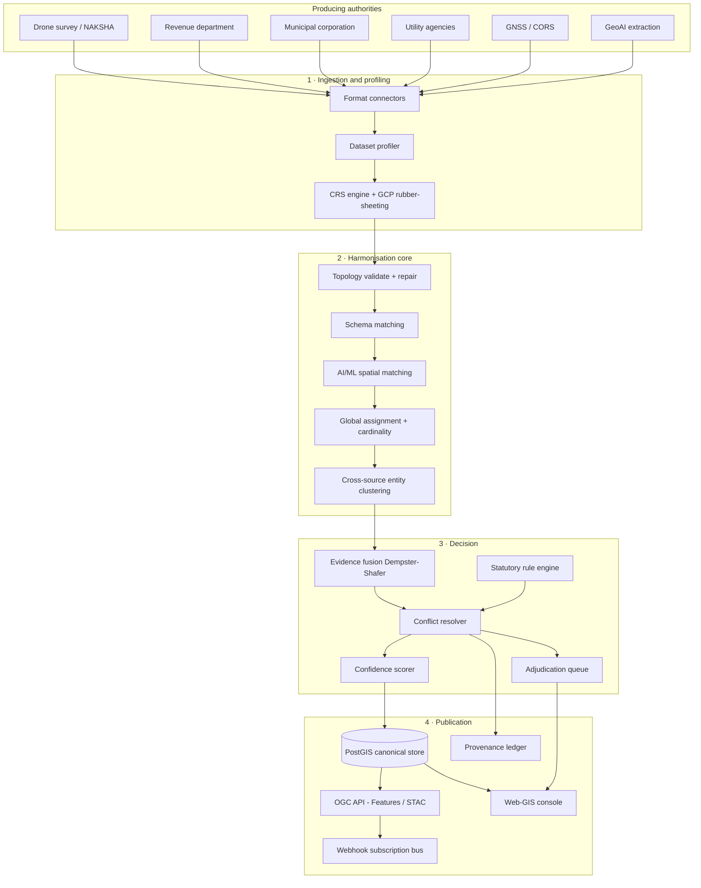
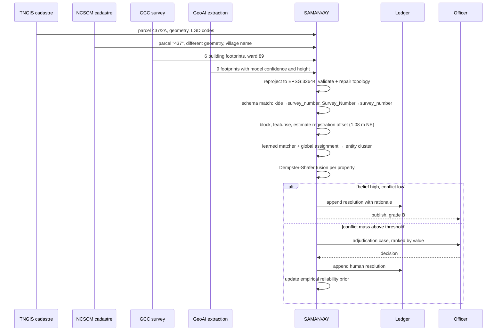
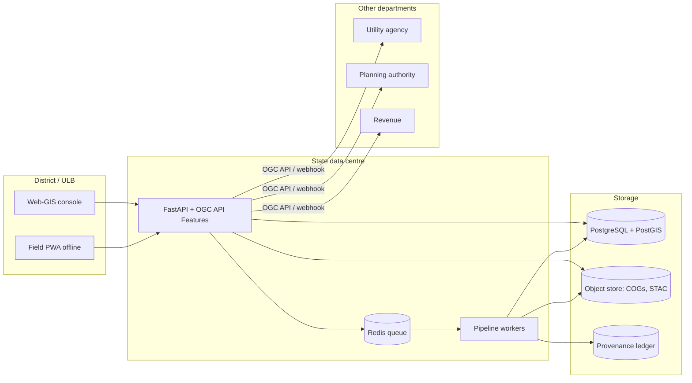

# Architecture

## 1. The shape of the problem determines the shape of the system

Multi-source geospatial harmonisation looks like an ETL problem and is not one. ETL assumes
there is a right answer in the sources and the job is to move it. Here the sources
*disagree*, legitimately, and the job is to adjudicate. That single observation drives every
structural decision below.

Three consequences follow, and they are the load-bearing ideas of the whole design.

**Claims, not records.** Nothing that enters the platform is treated as fact. A source
asserts a *claim* about a property of an entity; the platform decides which claims survive
and records why. Because claims are never deleted, any decision can be re-examined, and a
change of policy — a new reliability prior, a new statutory rule — can be replayed over the
same claims without re-ingesting anything.

**Belief and plausibility, not probability.** Probability forces the mass not assigned to a
hypothesis onto its negation, so a single source asserting something becomes an implicit
refutation of every alternative. Dempster-Shafer evidence theory lets mass sit on
"unknown", which is the correct state when only one department has an opinion. The gap
between belief and plausibility is the platform's measure of ignorance, and it is what
decides whether a human is needed.

**Repair is a recorded act, not a cleanup step.** Every geometric correction moves a
boundary somebody owns. Repairs are bounded, audited, and refused when they exceed
tolerance.

## 2. Layered view

## 3. Component responsibilities

| Layer | Module | Responsibility | Key decision |
|---|---|---|---|
| Ingest | `ingest.vector` | Streaming connectors for GeoJSONL, GeoJSON, SHP, GPKG, KML, FGB, GeoParquet, WKT-CSV | Streaming with a textual bbox pre-screen, so a 1 GB cadastral file is filtered in 40 MB of RAM rather than 6 GB |
| Ingest | `ingest.tiles` | Rebuild georeferenced COGs from published XYZ pyramids; invert colour-ramped DSMs | Much real photogrammetric output is published only as tiles; refusing to consume it would exclude most available drone data |
| Ingest | `ingest.gnss` | RINEX headers, NMEA rover logs, CSV control lists | Uncertainty is carried through; a control point without a sigma is rejected as control |
| CRS | `crs.engine` | Everest/Kalianpur legacy datums, India zones, EPSG:7755, geodesic area, Indian area units | Measurement never happens in EPSG:4326 or 3857; area error at Chennai's latitude in Web Mercator is 5.4% |
| CRS | `crs.gcp` | Helmert / affine / polynomial / thin-plate spline with blunder detection and leave-one-out validation | Model selection is by LOO RMSE with a parsimony margin, so a spline cannot masquerade as accuracy |
| Topology | `topology.validate` | 15 cadastral integrity rules, planar-partition error | Detection is separated from repair so the audit shows the *pre-repair* state |
| Topology | `topology.repair` | Bounded, audited correction in a fixed order | Snapping precedes sliver absorption because it removes the *cause* rather than the symptom |
| Attributes | `attributes.schema_match` | Four-signal automatic crosswalk to the canonical schema | Instance-based value profiling is what solves `kide → survey_number`; name similarity alone cannot |
| Attributes | `attributes.translit` | Indic transliteration and name/place linkage keys | One owner appears as four romanisations across four departments |
| Matching | `matching.features` | Blocking + 22-feature pair descriptor | Search radius derived from declared accuracies, not a magic constant |
| Matching | `matching.model` | Weak supervision + self-training gradient-boosted matcher | No labelled truth set exists for this problem and waiting for one is why it stays unsolved |
| Matching | `matching.assign` | Per-component optimal assignment, cardinality detection | Argmax per feature produces contradictions; assignment must be global |
| Conflict | `conflict.evidence` | Dempster-Shafer with independence discounting | Three derivatives of one survey are one witness |
| Conflict | `conflict.resolver` | Statutory rules → precedence → fusion → escalation | Some answers are not evidential: a poramboke classification is not overturned by a rooftop |
| Conflict | `conflict.queue` | Value-ranked, batched adjudication with an active-learning feedback channel | Officer time is the scarcest resource in the system |
| Confidence | `confidence.scorer` | Six explainable dimensions plus composite and grade | One number cannot tell an officer what to *do* |
| Raster | `raster.terrain` | Progressive morphological DSM→DTM, nDSM, structure extraction | nDSM is the direct measurement of built form |
| Raster | `raster.coreg` | Phase correlation with peak-sharpness validation, tiled variability | An unregistered pair lights up every building edge |
| Change | `change.vector_change` | Typed, registry-actionable change with systematic-offset suppression | A re-survey is one correction, not two thousand mutations |
| GeoAI | `geoai.change` | Three-signal raster change: spectral, structural, geometric | Height is what separates a new building from a repainted roof |
| GeoAI | `geoai.footprints` | Regularisation with rectilinearity gating and area-change refusal | Footprint area is a tax base and must not be silently altered |

## 4. Data flow through one parcel

## 5. Deployment topology

The platform runs on a single machine for a district and scales horizontally by AOI tile:
the pipeline is deterministic per tile and tiles share nothing except the canonical store,
so a state-level run is an embarrassingly parallel map over tiles with a final merge.

## 6. Why these technologies

| Choice | Alternative considered | Reason |
|---|---|---|
| PostgreSQL + PostGIS | Elasticsearch, MongoDB with geo | Only PostGIS gives exact topological predicates, generated columns, and the transactional guarantees a land record needs. Spatial indexes on 6 M parcels are routine. |
| Streaming GeoJSONL reader | GeoPandas load | The real TN cadastral file is 1.07 GB; loading it costs several GB of RAM and a minute. Streaming costs 40 MB and seconds, which is what makes the platform runnable on district-office hardware. |
| HistGradientBoosting | Deep set/graph matcher | Features are heterogeneous in scale with informative missing values; boosted trees handle both natively, train in seconds on a CPU, and give per-prediction attribution — which a government decision needs. |
| Weak supervision | Hand-labelled training set | No labelled cadastral correspondence set exists anywhere in India. Programmatic labelling plus self-training gets a working matcher on day one and improves with every adjudication. |
| Dempster-Shafer | Bayesian fusion | DS separates disagreement from ignorance. That distinction is what produces the adjudication queue. |
| Hash-chained ledger | Blockchain | There is no consensus problem: DoLR is the single writer. A hash chain with an external anchor gives the same integrity guarantee at a millionth of the cost. |
| OGC API - Features | Custom REST | Inter-departmental exchange is the point. A department must be able to use QGIS against it with no SAMANVAY-specific code. |
| MapLibre / Leaflet + vanilla JS console | Heavy SPA framework | The console must run in a district office on an old browser with a slow link. |

## 7. Failure behaviour

A land-records platform's failure modes matter more than its features.

| Failure | Behaviour |
|---|---|
| A source layer contains geometry GEOS cannot process | The feature is reported invalid, the partition scan continues on repaired copies, and the layer is not lost |
| Ground control is absent | Positional confidence falls back to declared accuracy and *says so* in the note; it never silently claims measured accuracy |
| Sources disagree beyond tolerance | Escalation, not averaging — the platform never emits a boundary no surveyor observed |
| A repair would move a vertex beyond ceiling | Refused and escalated as a survey discrepancy |
| The matcher has too little signal to train | Falls back to a transparent geometric scorer, and the report says the fallback is in use |
| Pipeline crashes mid-run | Stage checkpoints let it resume; partial state is inspectable rather than discarded |
| The ledger is tampered with | `verify()` names the exact index at which the chain breaks |
